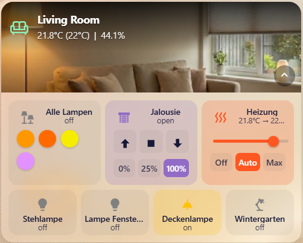
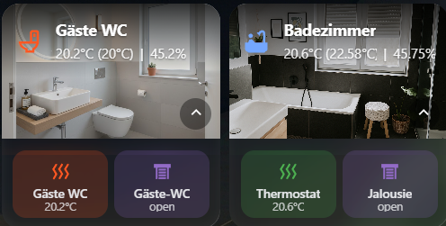

# OneLine Room Card

[](https://github.com/hacs/integration)
[](https://github.com/lop1505/RoomCard/releases)

A clean, performant, and fully visually configurable room card for Home Assistant.
Developed with a focus on stability, simple design, and maximum flexibility.




## ⚠️ Important: Renaming / Migration
To ensure compatibility and avoid conflicts with other cards, this card has been renamed.
* **Old Type:** `custom:room-card`
* **New Type:** `custom:oneline-room-card`

If you are updating from an older version, please update your YAML configuration. The old type will show a migration warning.

## ✨ Features

* 🖱️ **Full Visual Editor:** No YAML required. The optimized editor ensures smooth configuration without focus loss.
* 📱 **Responsive Flex Layout:** Buttons intelligently wrap on smaller screens (Mobile/Tablet) while maintaining your preferred relative widths. No more cut-off content!
* 🌡️ **Smart Climate Integration:** Optionally select a main climate device (e.g., Tado, Netatmo) to automatically display temperature and humidity in the header.
* 🌍 **Dynamic Unit Support:** Automatically adapts to your Home Assistant system settings (Celsius, Fahrenheit).
* 📏 **Flexible Sizing:** Buttons can take up 1/3, 1/4, 1/5, etc. of the width. Important buttons can be taller, others smaller.
* 🔋 **Advanced Status Chips:** Automatically alerts you about room status:
  * **Windows:** Shows open windows immediately.
  * **Batteries:** Differentiates between "Critical" (≤ 5%), "Low" (≤ 15%), or "Empty" (Binary Sensors).
* ⚡ **Performance:** Vanilla JS, no external dependencies, loads extremely fast.
* 🖱️ **Sortable:** Easily move buttons using arrow keys in the editor.
* 🖼️ **Built-in Image Uploader:** Upload your room background images directly in the card editor. No file manager needed!
* 👆 **Configurable Actions:** Define what happens on **Tap**, **Hold**, and **Double Tap** for every single button (Toggle, More Info, Navigate, etc.).
* 🌡️ **Target Temperature:** Optionally display the setpoint/target temperature next to the current room temperature.

## 📥 Installation

### Via HACS (Recommended)
[](https://my.home-assistant.io/redirect/hacs_repository/?owner=lop1505&repository=RoomCard&category=plugin)

or

1. Open HACS -> Frontend.
2. Click the menu (three dots) in the top right corner -> **Custom repositories**.
3. Paste the URL of this repository.
4. Select category **Lovelace** (or **Dashboard**).
5. Click "Add" and then "Install".

### Manual Installation
1. Download the `room-card.js` file from the latest release.
2. Copy it to your `/config/www/` folder.
3. Add the resource to your Dashboard configuration:
   - URL: `/local/room-card.js`
   - Type: JavaScript Module

## ⚙️ Configuration

Simply add the card via "Add Card" in your dashboard and select **"OneLine Room Card"**.
The visual editor guides you through all settings:

* **General:** Name, Icon, Colors. **New:** Use the "Upload Image" button to set your background instantly.
* **Sensors:** Select your temperature (current & target), humidity, window, and battery sensors.
* **Buttons:** Add devices and configure their dimensions. You can now assign specific actions (Tap/Hold/Double Tap) to each button.
* **Optional State Text:** Toggle **Show State** per button if you want a cleaner layout without the on/off line.

### Template Buttons (Optional)
You can switch a button row to **Template** to render dynamic text/icon/color/state.

* Use **JavaScript** inside `${ ... }`.
* Helpers available: `hass`, `states`, `entity(id)`, `attr(id, name)`, `ctrl`.

Example:
```
content: ${entity("climate.living_room")?.state?.toUpperCase() ?? "—"}
icon: ${(({heat:"mdi:fire",cool:"mdi:snowflake"}[(entity("climate.living_room")?.state||"").toLowerCase()]) ?? "mdi:help-circle")}
color: ${(({heat:"#FF5722",cool:"#2196F3"}[(entity("climate.living_room")?.state||"").toLowerCase()]) ?? "#9E9E9E")}
state: ${attr("climate.living_room","hvac_action") ?? ""}
```

---

## ☕ Support

Do you like my work? I develop this card in my free time. I would be very happy about a coffee!

<a href="https://www.buymeacoffee.com/oneline1505" target="_blank"></a>

---
*Developed by OneLine*
