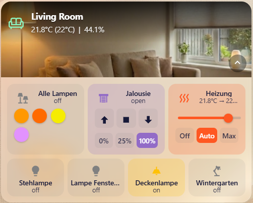
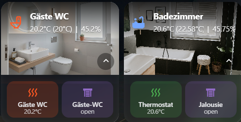

# OneLine Room Card

[](https://github.com/hacs/integration)
[](https://github.com/lop1505/RoomCard/releases)

A clean, performant, and fully visually configurable room card for Home Assistant.
Developed with a focus on stability, simple design, and maximum flexibility.




## ✨ Features

* 🖱️ **Full Visual Editor:** No YAML required. The optimized editor ensures smooth configuration without focus loss.
* 📱 **Responsive Flex Layout:** Buttons intelligently wrap on smaller screens (Mobile/Tablet) while maintaining your preferred relative widths. No more cut-off content!
* 🌡️ **Smart Climate Integration:** Optionally select a main climate device (e.g., Tado, Netatmo) to automatically display temperature and humidity in the header.
* 🌍 **Dynamic Unit Support:** Automatically adapts to your Home Assistant system settings (Celsius, Fahrenheit).
* 🧭 **Label & Status Position:** Choose where label/status appear (**Right / Left / Top / Bottom**) per button, with a global default.
* 📏 **Flexible Sizing:** Buttons can take up 1/3, 1/4, 1/5, etc. of the width. Important buttons can be taller, others smaller.
* 🔋 **Advanced Status Chips:** Automatically alerts you about room status:
  * **Windows:** Shows open windows immediately.
  * **Batteries:** Differentiates between "Critical" (≤ 5%), "Low" (≤ 15%), or "Empty" (Binary Sensors).
* 🎨 **Header Typography:** Customize font size, weight, and style for the room name and info line directly in the editor.
* 💧 **Humidity Warning:** Optional high-humidity chip and blue outline with configurable threshold.
* ⚡ **Performance:** Vanilla JS, no external dependencies, loads extremely fast.
* 🖱️ **Sortable:** Reorder buttons via drag & drop or arrow keys in the editor.
* 🖼️ **Built-in Image Uploader:** Upload your room background images directly in the card editor. No file manager needed!
* ⚡ **Quick Add (Editor):** Add buttons quickly from existing entity types using the Quick Add accordion.
* 🧩 **Editor Sections:** Collapsible sections for Image, Manual Sensors, and Batteries.
* 🧭 **Bulk Expand/Collapse (Editor):** Expand or collapse all button settings at once.
* 👆 **Configurable Actions:** Define what happens on **Tap**, **Hold**, and **Double Tap** for every single button (Toggle, More Info, Navigate, etc.).
* 🌡️ **Target Temperature:** Optionally display the setpoint/target temperature next to the current room temperature.
* 🧩 **Collapsible Button Editor:** Each button configuration can be expanded/collapsed for faster navigation in large cards.
* 🧼 **Cleaner Buttons:** Toggle **Show State**, **Show Label**, and **Show Icon** per button to reduce visual noise.
* ↕️ **Text Order:** Choose which text comes first (State/Value or Name) per button.
* 🎯 **Button Visibility:** Hide/show individual buttons without deleting them.
* 🎛️ **Manual Color Override:** Force a custom color for a button icon even when the entity is inactive.
* 🎨 **Dynamic Header Icon Coloring:** Header icon now follows the same state-based color logic as buttons.
* 📴 **Offline/Unavailable Handling:** `unavailable` / `unknown` entities are clearly indicated and safely non-interactive.
* 🧭 **Device Picker:** Select a device and let the editor auto-pick a suitable entity.
* 🧩 **Template Presets:** Add buttons using type presets (Light/Switch/Climate/Cover/Media).
* 💡 **Dynamic State Icons:** Button icons automatically change based on entity state — no configuration required for common domains (Light, Switch, Fan, Lock, Cover, Media Player). Override with `icon_map` for custom per-state icons.
* 🏷️ **Custom Header Badges:** Add extra header info entries for any entity with optional custom label, name toggle, and configurable `rgba(...)` background.
* 🌡️ **Main Climate Header Badge Styling:** The built-in main climate header info (temperature / humidity) can use its own optional `rgba(...)` badge background.
* 📐 **Configurable Header Height:** Set `header_height` (px) to reduce or fully hide the header image area.
* 🌡️ **Climate Inline Slider:** Control the target temperature directly on a climate button — displays current → setpoint while dragging, with live feedback.
* 🗂️ **Structured Editor:** Settings split into a **Konfiguration** tab (Card Behavior + Header) and a dedicated **Buttons** tab — each section collapsible for a cleaner editing experience.
* 🎨 **Window Chip Colors:** Customize open/closed chip color for window/door sensors, with an option to always show chips.
* 🎨 **State-Dependent Button Colors (`color_map`):** Automatically change button icon color and background based on entity state.
* 📐 **Configurable Icon Size:** Set `icon_size` per button or `global_icon_size` as a card-level default.

### Header Icon Color Priority
Header icon color now follows this order:
1. **Force Color** (manual override)
2. **Dynamic state-based color** (same logic as buttons, including climate `hvac_action`)
3. **Default theme color**

No scripting is required, and existing dashboards remain backward compatible.

## 🆕 What’s new in 1.2.4

* Runtime: **Climate Inline Slider** — `control_mode: slider` now works for `climate` entities. Drag to set the target temperature; the button state shows current → setpoint and updates live while dragging. Closes [#44](https://github.com/lop1505/RoomCard/issues/44).
* Runtime: **Window Sensor Chip Colors** — window/door sensor chips in the header support custom colors for open and closed states, plus an option to always show the chip even when closed. Closes [#49](https://github.com/lop1505/RoomCard/issues/49).
* Runtime: **State-Dependent Button Colors (`color_map`)** — buttons can automatically change icon color and background based on the entity’s current state.
* Editor UX: **Dedicated Buttons Tab** — button configuration (Quick Add, bulk toggle, individual buttons) is now on its own **Buttons** tab, keeping **Konfiguration** focused on card and header settings. Closes [#42](https://github.com/lop1505/RoomCard/issues/42).
* Editor UX: **Redesigned General Settings** — the "General" section is now split into **Card Behavior** (name, live preview, collapsible) and **Header** (height, typography, icon, image), each collapsible independently. Closes [#43](https://github.com/lop1505/RoomCard/issues/43).
* Runtime: **Configurable Icon Size** — set `icon_size` per button or `global_icon_size` as a card-level default (in px). Closes [#48](https://github.com/lop1505/RoomCard/issues/48).
* Runtime: **Header Position Sliders** — drag the header info line (temp/humidity/badges) and the title left, center, or right with sliders. A new **Synchronize Positions** toggle lets you link them together. The info line now also prevents text wrapping to maintain a clean layout. Closes [#47](https://github.com/lop1505/RoomCard/issues/47).
* Runtime: **CSS Custom Properties for Buttons** — expose `--rc-btn-bg` and `--rc-icon-color` for advanced `card-mod` styling. Closes [#46](https://github.com/lop1505/RoomCard/issues/46).
* Runtime: **Cover Position Presets** — tap-to-set preset buttons for covers/blinds (default: 0%, 50%, 100%), configurable per button. Active position highlighted automatically. Closes [#41](https://github.com/lop1505/RoomCard/issues/41).
* Editor UX: **Merged Sensors Section** — "Sensors (Manual)" and "Batteries (List)" are now a single collapsible **Sensors** section with a unified badge count.
* Editor UX: **Fixed Expand/Collapse All Buttons** — the `><` bulk toggle now correctly tracks open/closed state for all button entries.

### Climate Inline Slider (new in 1.2.4)

Configure `control_mode: slider` on a climate button for direct temperature control:

```yaml
controls:
  - entity: climate.living_room
    name: Heizung
    control_mode: slider    # Target temperature slider
```

* Slider range is taken from the entity’s `min_temp` / `max_temp` attributes (fallback: 5–35 °C).
* Step size is `0.5` (matching HA climate precision).
* Button state shows **current → target** temperature (e.g. `21.5°C → 22°C`) while dragging.
* On release, calls `climate.set_temperature` with the selected value.
* Unavailable entities fall back to normal disabled display.

| Option | Value | Effect |
|---|---|---|
| `control_mode` | `slider` | Inline temperature slider for climate entities |

### Window Sensor Chip Colors (new in 1.2.4)

Configure custom chip colors and visibility at card level:

```yaml
window_always_show: true     # show chip even when window is closed (default: false)
window_open_color: "#FFA000" # chip color when open (default: #FFA000)
window_closed_color: "#9E9E9E" # chip color when closed (default: #9E9E9E)
```

| Option | Default | Effect |
|---|---|---|
| `window_always_show` | `false` | Show chip for closed sensors too |
| `window_open_color` | `#FFA000` | Chip color (icon + background tint) when open |
| `window_closed_color` | `#9E9E9E` | Chip color when closed (only visible if `window_always_show: true`) |

### State-Dependent Button Colors — `color_map` (new in 1.2.4)

Override the button icon color and background automatically based on the entity state:

```yaml
controls:
  - entity: light.living_room
    color_map:
      "on": gold
      "off": grey
      default: steelblue   # fallback for unmapped states
```

* Hex colors (`#RRGGBB`) get a 20 % tinted background automatically.
* Named colors use `color-mix(in srgb, …)` for the background tint.
* Priority: `force_color` > `color_map` > domain logic (rgb_color, hvac_action, theme).
* Configure visually in the **Buttons** tab → expand a button → **State Colors** section.

---

## 🆕 What’s new in 1.2.3

* Editor UX: **Header Typography** section — customize the room name and info line font settings without CSS.
* Runtime: Expose header fonts as CSS Custom Properties for advanced `card-mod` usage.

### Header Typography (new in 1.2.3)

Available via the visual editor or YAML:

| Option | Description | Default |
|---|---|---|
| `header_name_size` | Font size of the room name | `14px` |
| `header_name_weight` | Font weight (normal, bold, 100-900) | `bold` |
| `header_name_style` | Font style (normal, italic) | `normal` |
| `header_info_size` | Font size of the info line | `12px` |
| `header_info_weight` | Font weight of the info line | `normal` |
| `header_info_style` | Font style of the info line | `normal` |

---

## 🆕 What’s new in 1.2.2

* Config: `header_height` — set the header image area height in pixels (default: 120). Set to `0` to fully hide the header image.
* Editor UX: New **Header Height (px)** number field in General settings.

### Configurable Header Height (new in 1.2.2)

```yaml
type: custom:oneline-room-card
name: Living Room
header_height: 80   # default: 120, set to 0 to hide header
```

| Option | Values | Default |
|---|---|---|
| `header_height` | Integer ≥ 0 | `120` |

---

## 🆕 What’s new in 1.2.1

* Runtime: **Collapsible card** — toggle the button grid by clicking the header image. State persists across reloads via `localStorage`.
* Config: `collapsible: true` enables the feature; `default_state: collapsed` starts the card folded.
* Editor UX: New **Collapsible** toggle and **Default State** dropdown in General settings.

### Collapsible Card (new in 1.2.1)

```yaml
type: custom:oneline-room-card
name: Living Room
collapsible: true
default_state: collapsed   # optional, default: expanded
```

| Option | Values | Default |
|---|---|---|
| `collapsible` | `true` · `false` | `false` |
| `default_state` | `expanded` · `collapsed` | `expanded` |

* Clicking the header image toggles the button section.
* A chevron indicator (↓/↑) appears bottom-right of the header.
* The last user state is remembered in `localStorage` per card (by name/entity).
* Smooth 350 ms CSS height animation.

---

## 🆕 What’s new in 1.2.0

* Runtime: **Inline Slider Controls** — add a brightness slider directly on light buttons, or a position slider on cover buttons (`control_mode: slider`).
* Runtime: **Inline Cover Buttons** — add Open / Stop / Close buttons directly on cover tiles (`control_mode: buttons`).
* Editor UX: New **Control Mode** dropdown per button (Default / Inline Slider / Inline Buttons).

### Inline Controls (new in 1.2.0)

Configure `control_mode` per button to add direct controls without opening a detail dialog:

```yaml
controls:
  - entity: light.living_room
    name: Ceiling Light
    control_mode: slider       # Brightness slider (0–100%)

  - entity: cover.blinds_kitchen
    name: Blinds
    control_mode: slider       # Position slider (0–100%)

  - entity: cover.blinds_bedroom
    name: Blinds
    control_mode: buttons      # ↑ Stop ↓ action buttons
```

| Value | Effect |
|---|---|
| *(not set)* | Default tap/hold behaviour |
| `slider` | Inline range slider — brightness for lights, position for covers |
| `buttons` | Open / Stop / Close buttons — covers only |

* The slider fill color follows the entity’s active state color.
* Slider and cover buttons block tap/hold actions to avoid conflicts.
* Unavailable entities fall back to normal (disabled) display.

---

## 🆕 What’s new in 1.1.1
* Runtime: **Dynamic state icons** — buttons automatically show state-dependent icons for common domains (Light: `mdi:lightbulb` / `mdi:lightbulb-outline`, Switch, Fan, Lock, Cover, Media Player). No configuration needed for new buttons; existing buttons with a manually set icon are unaffected.
* Runtime: Custom `icon_map` per button for explicit per-state icon overrides (highest priority, supports YAML `on`/`off` boolean keys automatically).
* Runtime: **Custom header badges** in the info line with per-badge label toggle and optional `rgba(...)` background.
* Runtime: Built-in main climate header info supports optional `rgba(...)` badge background.
* Editor UX: Quick Add type selector no longer resets visually on HA state updates (closes #32).

## 🆕 What’s new in 1.1.0

* Runtime: Improved handling for `unavailable` / `unknown` entities (dimmed controls, offline indicator, blocked actions).
* Runtime: Header icon uses the same dynamic state-based color logic as buttons.
* Runtime: Header icon supports Force Color override with safe fallback to dynamic/theme color.
* Editor UX: New **Live preview** toggle (enabled by default).
* Editor UX: Quick Add type selector no longer resets visually on HA state updates.
* Performance: Internal state-signature caching reduces unnecessary DOM/UI updates.
* Internal: Centralized state definitions for active/offline checks (maintainability improvement, no user config change).

### Header Icon Color Priority
Header icon color now follows this order:
1. **Force Color** (manual override)
2. **Dynamic state-based color** (same logic as buttons, including climate `hvac_action`)
3. **Default theme color**

No scripting is required, and existing dashboards remain backward compatible.

## 🆕 What's new in 1.1.1

* Fix: Removed `MigrationWarningCard` / `room-card` alias to prevent conflicts with other custom cards that use the same element name (e.g. thomasloven's or benct's room-card). Previously, if oneline-room-card loaded first, it would block other `room-card` implementations from registering, breaking those dashboards.

## 🆕 What's new in 1.1.0

* Runtime: Improved handling for `unavailable` / `unknown` entities (dimmed controls, offline indicator, blocked actions).
* Runtime: Header icon uses the same dynamic state-based color logic as buttons.
* Runtime: Header icon supports Force Color override with safe fallback to dynamic/theme color.
* Editor UX: New **Live preview** toggle (enabled by default).
* Performance: Internal state-signature caching reduces unnecessary DOM/UI updates.
* Internal: Centralized state definitions for active/offline checks (maintainability improvement, no user config change).

## 🆕 What's new in 1.0.9

* Runtime: High-humidity warning chip and blue outline with configurable threshold (`humidity_warning_threshold`, default `60`).
* Runtime: Label/status position modes (**right/left/top/bottom**) with per-button `label_position` and global `global_label_position`.
* Runtime: Battery and humidity warnings now highlight the card outline.
* Editor UX: Quick Add accordion to add buttons from existing entity types.
* Editor UX: Collapsible sections for Image, Manual Sensors, and Battery list.
* Editor UX: Drag & drop reordering plus bulk expand/collapse button settings.
* Fix: Editing a button no longer collapses entries or jumps the editor scroll.

## 📥 Installation

### Via HACS (Recommended)
[](https://my.home-assistant.io/redirect/hacs_repository/?owner=lop1505&repository=RoomCard&category=plugin)

or

1. Open HACS -> Frontend.
2. Click the menu (three dots) in the top right corner -> **Custom repositories**.
3. Paste the URL of this repository.
4. Select category **Lovelace** (or **Dashboard**).
5. Click "Add" and then "Install".

### Manual Installation
1. Download the `room-card.js` file from the latest release.
2. Copy it to your `/config/www/` folder.
3. Add the resource to your Dashboard configuration:
   - URL: `/local/room-card.js`
   - Type: JavaScript Module

## ⚙️ Configuration

Simply add the card via "Add Card" in your dashboard and select **"OneLine Room Card"**.
The visual editor guides you through all settings:

* **General:** Name, Icon, Colors, Background Image, and optional **Tap → Navigate** path.
* **Main Climate Header Badge:** Optional `rgba(...)` background for the built-in temperature / humidity info line.
* **Header Icon Color:** Uses the same behavior as buttons with **Force Color** support in the editor.
* **Sensors:** Select your temperature (current & target), humidity, window, and battery sensors. Optional humidity warning threshold.
* **Header Badges:** Add extra header info entries for any entity, with optional custom label, name visibility, and `rgba(...)` background.
* **Buttons:** Add devices/entities, set width/height, alignment, and actions (Tap/Hold/Double Tap).
* **Cleaner Buttons:** Toggle **Show State**, **Show Label**, **Show Icon**, and **Visible** per button.
* **Text Order:** Choose whether **State/Value** or **Name** appears first.
* **Label Position:** Set **Right / Left / Top / Bottom** per button and a global default.
* **Manual Color:** Force a custom icon color (always visible).
* **Template Presets:** Add buttons from type presets, or switch a row to **Template**.
* **Editor UX:** Button entries are collapsible for better overview.
* **Live preview:** Enabled by default. Disable it to update preview only after saving (helpful on slower devices / large dashboards).

### Unavailable / Offline behavior
When an entity is `unavailable` or `unknown`:
* its control is visually dimmed/disabled,
* an offline indicator (icon/tooltip) is shown,
* toggle/actions are ignored until the entity is available again.

This improves feedback and prevents accidental actions, while keeping layout and behavior stable.

### Dynamic State Icons (new in 1.1.0)

Button icons automatically change based on entity state for common domains. No extra configuration needed when adding new buttons via the editor.

Supported domains and their default icon maps:

| Domain | State → Icon |
|---|---|
| `light` | `on` → `mdi:lightbulb` / `off` → `mdi:lightbulb-outline` |
| `switch` | `on` → `mdi:toggle-switch` / `off` → `mdi:toggle-switch-off-outline` |
| `fan` | `on` → `mdi:fan` / `off` → `mdi:fan-off` |
| `lock` | `locked` → `mdi:lock` / `unlocked` → `mdi:lock-open-outline` |
| `cover` | `open` → `mdi:window-shutter-open` / `closed` → `mdi:window-shutter` |
| `media_player` | `playing` → `mdi:cast-connected` / `idle` → `mdi:cast` / `off` → `mdi:cast-off` |

**Override with `icon_map`** for fully custom per-state icons:
```yaml
controls:
  - entity: light.living_room
    icon_map:
      on: mdi:ceiling-light
      off: mdi:ceiling-light-outline
```

**Static icon override:** Set the `icon` field in the editor to pin a single icon regardless of state.

**Priority:** `icon_map[state]` → `icon` (static) → built-in domain default → `attributes.icon` → `mdi:circle`

### Custom Header Badges (new in 1.1.1)

Add extra header info entries for any entity using `header_badges`:

```yaml
header_info_background: rgba(255,255,255,0.18)
header_badges:
  - entity: binary_sensor.door_front
    label: Front door
    show_name: true
    background: rgba(255,0,0,0.22)
  - entity: sensor.living_room_co2
    label: CO₂
    show_name: false
    background: rgba(33,150,243,0.22)
```

| Option | Values | Default |
|---|---|---|
| `entity` | Any HA entity ID | *(required)* |
| `label` | Display text | `friendly_name` |
| `show_name` | `true` · `false` | `true` |
| `background` | Any CSS color, recommended `rgba(...)` | none |
| `header_info_background` | Any CSS color, recommended `rgba(...)` | none |

Behavior:
* Built-in main climate info uses `header_info_background` when set.
* Custom `header_badges` are appended to the same header info line.
* If `show_name: false`, only the entity value is shown.
* `background` applies only to the corresponding custom header badge.

### New in 1.0.9 (YAML options)
```yaml
type: custom:oneline-room-card
humidity_warning_threshold: 60
global_label_position: bottom  # right | left | top | bottom
controls:
  - entity: light.living_room
    label_position: bottom      # global | right | left | top | bottom
```

### Technical improvements (internal)
* Room Card now tracks relevant entity state signatures and updates UI only when relevant values change.
* Active/offline state checks are now centrally defined, making maintenance and future extensions safer.
* No additional configuration is required for these optimizations.

## ⚠️ Migration 1.1.0 → 1.1.1

No breaking changes.

## ⚠️ Migration 1.0.9 → 1.1.0

No breaking changes.

* Existing YAML configs continue to work.
* Existing header `color` values keep their visual behavior through conservative backward-compat handling.

## ⚠️ Migration 1.0.8 → 1.0.9

No breaking changes. `global_label_position` is new; existing configs using `buttons_label_position` remain supported as a fallback.

### Template Buttons (Optional)
You can switch a button row to **Template** to render dynamic text/icon/color/state.

* Use **JavaScript** inside `${ ... }`.
* Helpers available: `hass`, `states`, `entity(id)`, `attr(id, name)`, `ctrl`.

Example:
```
content: ${entity("climate.living_room")?.state?.toUpperCase() ?? "—"}
icon: ${(({heat:"mdi:fire",cool:"mdi:snowflake"}[(entity("climate.living_room")?.state||"").toLowerCase()]) ?? "mdi:help-circle")}
color: ${(({heat:"#FF5722",cool:"#2196F3"}[(entity("climate.living_room")?.state||"").toLowerCase()]) ?? "#9E9E9E")}
state: ${attr("climate.living_room","hvac_action") ?? ""}
```

---

## ☕ Support

Do you like my work? I develop this card in my free time. I would be very happy about a coffee!

<a href="https://www.buymeacoffee.com/oneline1505" target="_blank"></a>

---
*Developed by OneLine*