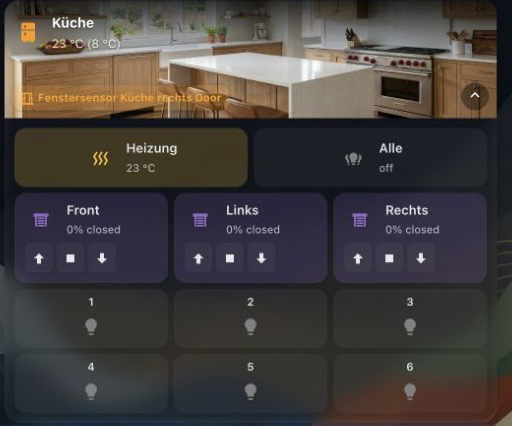
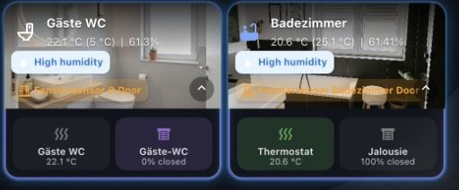
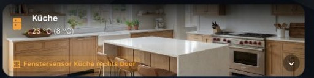
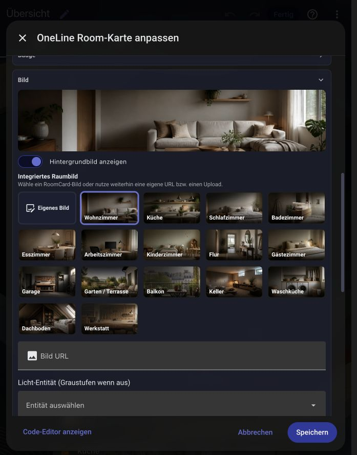

# OneLine Room Card

[](https://www.home-assistant.io)
[](https://github.com/hacs/integration)
[](https://github.com/lop1505/RoomCard/releases)
[](LICENSE)
[](https://github.com/lop1505/RoomCard/stargazers)

A clean, performant, and fully visually configurable room card for Home Assistant.
Developed with a focus on stability, simple design, and maximum flexibility.

## 📸 Screenshots

**🎛️ Full-width room controls**



**📱 Compact grid layout**



**🗂️ Collapsed view**



---

## 🆕 What's new in 1.4.0

* 🔎 Open opt-in sparkline details with 6h / 24h / 7d history and Min / Max / Average
* 🎬 Start scenes and scripts with Room Modes, including optional active-state highlighting
* 🌗 Switch header images using ordered conditions, with a reliable default-image fallback
* 📊 Summarize lights, windows, media, or power with configurable room-status groups
* 🖼️ Position header images with a visual focal-point editor and upload validated, automatically optimized JPEG, PNG, or WebP files
* ▶️ Use improved media controls with separate transport and volume rows, Previous support, square artwork, and stable keyboard focus
* 📈 Configure the card-level sparkline refresh interval; shared history requests and visibility-aware polling reduce background work
* 🚨 Disable warning borders independently while keeping active sensor chips visible
* ♿ Navigate cards, collapsed controls, dialogs, and inline actions with improved keyboard and screen-reader support
* ⚡ Keep template controls and sub-chips current when arbitrary referenced attributes change
* 🛡️ Render state-derived content safely by default, with trusted template HTML available only through explicit opt-in
* 🧪 Rely on expanded runtime/editor regression coverage and stricter release/HACS validation

All 1.4.0 options remain backwards compatible with existing cards.

See the [illustrated v1.4.0 release notes](docs/releases/v1.4.0.md) for screenshots of the new features.

---

## ✨ Features

**Editor**
* 🖱️ Full visual editor — no YAML required, with live preview
* 🖼️ Built-in image uploader — upload room backgrounds directly in the editor
* 🏠 Built-in room-image presets — choose from 16 bundled room backgrounds without hosting your own image
* 🧭 Quick Add — add buttons from existing entity types in one click, including `select` / `input_select`
* 🏠 Area-Based Auto-Setup — pick a Home Assistant area and one click auto-populates climate, controls (light/switch/cover/fan/media_player/lock), temperature/humidity/window/battery sensors
* 🖱️ Drag & drop reordering, bulk expand/collapse, collapsible button entries

**Header**
* 🌡️ Smart climate integration — temperature, humidity and target temp auto-populated
* 🌍 Dynamic unit support — Celsius / Fahrenheit from HA system settings or an optional per-card override
* 🏷️ Custom header badges — any entity with optional label, name toggle and `rgba(...)` background
* 📐 Configurable header height — set in px, or `0` to hide completely
* 🚫 Hide background image (`show_image: false`) — collapses the header to its content height while keeping name, icon, badges and chips visible
* 🌗 Image grayscale by light state (`image_entity`) — header image fades to grayscale when the chosen light/switch is off
* 🚶 Presence indicator chip (`presence_sensor`) — configurable color and optional solid background when a person / motion / device tracker is active
* 🚨 Configurable alert sensors — red header chips and red card outline when sensors trip; collapsed mode shows a count badge with click-to-list dialog
* 🎨 Header typography — font size, weight, style, color and optional text shadow
* 📍 Header position sliders — drag title and info line left/right with snap points
* 🪟 Window sensor chips — custom colors for open/closed states
* 🔋 Battery warning chips — Critical / Low / Empty with card outline
* 💧 Humidity warning chip — configurable threshold with card outline
* 🗂️ Collapsible card — click header to collapse/expand, state persists

**Buttons**
* 📏 Flexible sizing — width (1/3, 1/4, …) and height per button
* 🎛️ Inline slider — brightness (light), position (cover), temperature (climate), volume (media player)
* 🔘 Inline cover buttons — Open / Stop / Close directly on the tile
* ▶️ Media player controls — transport buttons, volume slider, source/sound-mode chips and optional media title
* 🔽 Select / Input Select buttons — add dropdown-style entities and control options with inline Previous / Next buttons
* 🎨 Color Favorites — tap-to-set RGB swatches on light buttons
* 💡 Brightness presets — tap-to-set brightness chips for lights (e.g. 25% / 50% / 75% / 100%)
* 🌡️ Climate presets — tap-to-set temperature presets (fixed, `auto`, `max`)
* 🔥 HVAC mode chips (`show_hvac_modes`) — tappable chips for `attributes.hvac_modes` with matching MDI icons (off/auto/heat/cool/heat_cool/dry/fan_only)
* 💨 Fan speed chips (`show_fan_modes`) — tappable chips for `attributes.fan_modes`
* 📈 Sensor sparklines (`show_sparkline`) — tiny line charts on sensor buttons; configurable history (`sparkline_hours`) and refresh cadence (`sparkline_refresh`)
* 🎬 Room Modes (`room_modes`) — horizontally scrollable scene/script shortcuts with optional active-state highlighting
* 🖼️ Adaptive header images (`adaptive_images`) — first-match condition rules with per-image focal points
* 📊 Aggregate room status (`status_groups`) — configurable counts and safe numeric summaries with optional details
* 📐 Cover position presets — tap-to-set position presets (default: 0% / 50% / 100%)
* 🎨 State-dependent colors (`color_map`) — icon color and background by entity state
* 💡 Dynamic state icons — auto icon per state for Light, Switch, Fan, Lock, Cover, Media Player
* 🎨 Custom icon map (`icon_map`) — per-state icon overrides
* 📐 Configurable icon size — per button or global default
* 🧼 Show/hide state, label, icon per button
* 🕐 Time since last change — `show_last_changed: true` shows elapsed time on the button (e.g. "2h 15min"), combined with state as "on · 2h"
* ↕️ Label position — Right / Left / Top / Bottom per button and global default
* 👆 Configurable actions — Tap / Hold / Double Tap per button
* 🧩 Action service payloads — `call-service` actions now support inline `service_data` JSON in the visual editor
* 📂 Nested Card Behavior actions — action settings are grouped under `Card Behavior` and default to collapsed
* 🎯 Button visibility toggle
* 📴 Unavailable / offline handling — dimmed, non-interactive, with indicator

**Advanced**
* 🖌️ CSS Custom Properties — `--rc-btn-bg`, `--rc-icon-color` for `card-mod` styling
* 📝 Template buttons — dynamic text, icon, color and state via JavaScript expressions, with explicit trusted-HTML opt-in
* ⚡ Vanilla JS with no runtime dependencies — built as a single HACS artifact

---

## 📥 Installation

### Via HACS (Recommended)
[](https://my.home-assistant.io/redirect/hacs_repository/?owner=lop1505&repository=RoomCard&category=plugin)

Or manually: HACS → Frontend → ⋮ → Custom repositories → paste URL → Category: Lovelace.

### Manual
1. Download the [latest release](https://github.com/lop1505/RoomCard/releases) and open its `dist` directory.
2. Copy `dist/room-card.js` **and** `dist/rooms/` to `/config/www/room-card/`.
3. Add resource: URL `/local/room-card/room-card.js` · Type: JavaScript Module.

HACS installs the card and bundled room images together automatically. Existing manual installations that keep `room-card.js` directly in `/config/www/` can retain `/local/room-card.js`; copy `dist/rooms/` to `/config/www/rooms/` so the relative preset URLs remain available.

---

## ⚙️ Configuration

Add the card via **"Add Card"** → select **OneLine Room Card**. The visual editor
covers all settings — no YAML required.

### Key YAML options

#### Card level
| Option | Default | Description |
|---|---|---|
| `name` | — | Room name |
| `entity` | — | Main entity (drives header icon color) |
| `image` | — | Header background image URL |
| `image_preset` | — | Bundled room image ID, e.g. `living-room`, `kitchen` or `bathroom`. A custom `image` URL takes precedence when both are present |
| `image_position` | `50% 50%` | Header image focal point as horizontal and vertical percentages, e.g. `40% 65%` |
| `adaptive_images` | — | Ordered condition rules that temporarily replace the fallback `image` / `image_preset` and may define their own `image_position` |
| `show_image` | `true` | Show the header background image. `false` hides the `` and dark gradient and lets the header collapse to content height while name / icon / badges / chips remain visible |
| `image_entity` | — | Light / switch / input_boolean / group entity. When this entity is off, the header image fades to grayscale |
| `header_height` | `120` | Header image height in px (`0` = hidden, ignored when `show_image: false`) |
| `show_header_text_shadow` | `true` | Show the text shadow behind the room name and header info line |
| `temp_unit` | HA default | Optional per-card temperature unit: `°C` or `°F`. Values are converted for display while climate service calls continue to use Home Assistant's system unit |
| `collapsible` | `false` | Enable click-to-collapse on header |
| `default_state` | `expanded` | `expanded` · `collapsed` |
| `tap_action` | — | Card tap action (e.g. `navigate`) |
| `hold_action` | `none` | Card hold action |
| `double_tap_action` | `none` | Card double tap action |
| `global_label_position` | `right` | Default label position for all buttons |
| `global_icon_size` | `20px` | Default icon size for all buttons |
| `global_button_background` | — | Default button background (e.g. `rgba(0,0,0,0)`) |
| `show_card_last_activity` | `false` | Show a header badge with elapsed time since the most recently changed button entity (e.g. `5 min`, `2h 15min`). Auto-refreshes every 60 s. |
| `sparkline_refresh` | `300` | Auto-refresh cadence for all sparkline buttons in seconds (60–3600); configurable in the visual editor under **Buttons** |
| `room_modes` | — | Ordered scene/script shortcuts shown between the header/info bar and controls |
| `status_groups` | — | Informational header chips that count matching states or sum compatible numeric sensor values |
| `detail_drawer.enabled` | `false` | Enable the opt-in Room Detail Drawer (v1.5 candidate) |
| `detail_drawer.title` | Card name | Optional title of the drawer |

#### Room Detail Drawer (v1.5 candidate)

Keep compact controls on the card and put additional controls in a responsive
room-details panel. It opens as a 480px right sidebar on desktop (from 768px),
or a full-width bottom sheet on smaller displays. The room image, header
information, status and Room Modes use the same configuration in both places.

```yaml
detail_drawer:
  enabled: true
  title: Living room
controls:
  - entity: light.ceiling
    display_in: both
  - entity: light.reading
    display_in: drawer
  - entity: media_player.living_room
    display_in: card
```

`display_in` accepts `card`, `drawer` and `both`; omitted or unknown values mean
`card`. If room details are disabled, all controls return to the card regardless
of placement. Existing `hide` and visibility conditions still apply. Order comes
from the single `controls` list; there is no second list to maintain.

Use the new **Room details** header button, or explicitly assign
`action: room-details` to a tap, hold or double-tap action. Existing card actions
and collapse behavior are not replaced; drawer controls remain expanded even
when the card is collapsed. History and HA detail dialogs open above the drawer.

In the visual editor, **Configuration → Room details** enables the drawer and
sets its title. Under **Buttons**, each control has **Display in → Card / Room
details / Both**. Reordering, duplication and area setup retain existing placement.
The preview button opens HA's existing card preview; it requires live preview.
With live preview off, changes apply through the existing Save workflow.

This feature is a v1.5 candidate, not part of the published v1.4.0 release.
See the [architecture and test gates](docs/room-detail-drawer.md).

#### Room Modes

Room Modes run `scene.turn_on` or `script.turn_on` directly. The strip stays visible
when controls are collapsed and scrolls horizontally on narrow cards. `active_when`
is optional; without a valid condition the mode remains usable but is never marked
active. Supported conditions are `state`, `numeric_state`, and nested `and`, `or`,
or `not` groups.

```yaml
room_modes:
  - entity: scene.living_room_movie
    name: Movie
    icon: mdi:movie-open
    color: "#9c6cff"
    active_when:
      - condition: state
        entity: input_select.living_room_mode
        state: movie
  - entity: script.living_room_relax
    name: Relax
    active_when:
      - condition: and
        conditions:
          - condition: numeric_state
            entity: sensor.living_room_illuminance
            below: 30
          - condition: not
            conditions:
              - condition: state
                entity: input_boolean.cleaning
                state: "on"
```

#### Built-in room images

Open the visual editor and go to **Configuration → Header → Image → Built-in room image**. Select a thumbnail to use it immediately. Choose **Own image** to return to the existing URL field or uploader.

The same Image section includes a draggable focal-point marker, keyboard-accessible horizontal/vertical sliders, and a Center reset. Uploads accept JPEG, PNG, and WebP files up to 20 MB. Images larger than 2560 px on either side are downscaled before Home Assistant stores them; smaller suitable images are uploaded unchanged.

Available preset IDs: `living-room`, `kitchen`, `bedroom`, `bathroom`, `dining-room`, `home-office`, `childrens-room`, `hallway`, `guest-room`, `garage`, `garden-patio`, `balcony`, `basement`, `laundry-room`, `attic`, and `workshop`.



The generation and usage record for the bundled images is documented in [docs/room-image-provenance.md](docs/room-image-provenance.md).

```yaml
type: custom:oneline-room-card
name: Living room
image_preset: living-room
```

#### Adaptive header images

Adaptive images are evaluated in editor order; the first valid matching rule
wins. If no rule matches—or a rule is incomplete—the existing `image`,
`image_preset`, and `image_position` remain the fallback. Only the selected image
is preloaded, and late image responses cannot replace a newer selection.

Configure rules under **Configuration → Header → Image → Adaptive images**.
Each rule supports a custom URL, Home Assistant upload or bundled preset, its own
focal point, and Home Assistant-style state, numeric, time, screen, user, and
nested `and` / `or` / `not` conditions.

```yaml
type: custom:oneline-room-card
name: Living room
image_preset: living-room
image_position: 50% 50%
adaptive_images:
  - name: Evening
    conditions:
      - condition: time
        after: "18:00:00"
    image: /local/rooms/living-room-evening.jpg
    image_position: 55% 45%
  - name: Occupied
    conditions:
      - condition: state
        entity: binary_sensor.living_room_occupancy
        state: "on"
    image_preset: living-room
```

#### Sensors & chips
| Option | Default | Description |
|---|---|---|
| `presence_sensor` | — | Person / `binary_sensor` / `device_tracker` entity. Adds a presence chip when active (`on`, `home`, `active`, `detected`) |
| `presence_sensor_label` | — | Custom label for the presence chip |
| `presence_chip_color` | `#4CAF50` | Base color for the presence chip |
| `presence_solid_background` | `false` | Use `presence_chip_color` as a solid background with automatically selected readable text color |
| `temp_sensor` | — | Temperature sensor (overrides climate) |
| `target_temp_sensor` | — | Target temperature sensor |
| `humid_sensor` | — | Humidity sensor (overrides climate) |
| `temp_sensor_label` | — | Custom label prefix for the temperature value |
| `target_temp_sensor_label` | — | Custom label prefix for the target temperature value |
| `humid_sensor_label` | — | Custom label prefix for the humidity value |
| `show_chip_shadow` | `true` | Show the box shadow behind presence, window and other sensor chips |
| `show_status_border` | `true` | Show the warning outline/glow for battery, humidity and alert states. `false` keeps the sensor chips visible but removes the card-level status border |
| `humidity_warning_threshold` | `60` | Humidity warning threshold (%) |
| `alert_sensors` | — | List of alert configurations: `{ entity, state, above, below }`. Triggers red header chips and a red card outline when active |
| `alert_chip_mode` | `expanded` | `expanded` shows one chip per active alert; `collapsed` shows a count badge that opens a list dialog on click |
| `alert_border_color` | `#d32f2d` | CSS color for the red card outline when alerts are active (any valid CSS color) |
| `window_sensors` | — | List of window/door sensors (`binary_sensor` or `sensor` domain) |
| `window_labels` | — | Per-window custom labels keyed by entity ID, e.g. `{ binary_sensor.bedroom_window: "Sofia's bedroom window" }` |
| `window_always_show` | `false` | Show chip even when closed |
| `window_open_color` | `#FFA000` | Chip color when open |
| `window_closed_color` | `#9E9E9E` | Chip color when closed |
| `window_solid_background` | `false` | Use the resolved window color as a solid chip background instead of a translucent tint |
| `window_open_states` | `["on","open"]` | List of state values treated as "open" (e.g. `["offen","gekippt"]` for custom sensors). `on` is always included automatically for backward compatibility. |
| `window_state_colors` | — | Per-state color overrides, e.g. `{ offen: "#FFA000", gekippt: "#FFD740" }` |
| `battery_sensors` | — | List of battery sensors |

```yaml
window_sensors:
  - binary_sensor.bedroom_window
window_labels:
  binary_sensor.bedroom_window: "Sofia's bedroom window"
window_solid_background: true
```

#### Aggregate room status

`status_groups` create neutral informational chips; they do not affect alerts,
warning borders, or badge priority. Groups only watch their explicitly configured
entities. Count mode matches `active_states`; numeric mode ignores unavailable,
unknown, and non-numeric values. Power sensors using `mW`, `W`, `kW`, or `MW`
are converted into the configured output unit before summing. Other units must
match exactly—an incompatible combination displays a clear unavailable result
instead of an incorrect total.

Set `details: true` to make the chip keyboard-accessible and open a list of the
contributing entities. Selecting a row opens Home Assistant more-info. The visual
editor provides presets for lights, windows, media, and power under
**Configuration → Room status**.

```yaml
status_groups:
  - name: Lights
    icon: mdi:lightbulb-group
    entities:
      - light.ceiling
      - light.floor_lamp
    active_states: ["on"]
    display: count
    hide_when_zero: true
    details: true
  - name: Power
    icon: mdi:flash
    entities:
      - sensor.tv_power
      - sensor.pc_power
    aggregate: sum
    display: value
    unit: W
    precision: 0
    details: true
```

#### Buttons (`controls`)
| Option | Default | Description |
|---|---|---|
| `entity` | — | Entity ID |
| `name` | — | Display label |
| `width` | `15` | Relative width (1–60) |
| `height` | `60` | Height in px |
| `control_mode` | — | `slider` · `buttons` · `full` (media player `full` combines volume slider and transport controls) |
| `color_map` | — | Per-state icon color map |
| `icon_map` | — | Per-state icon map |
| `show_media_sources` | `false` | Show media player source chips from `source_list` |
| `show_media_sound_modes` | `false` | Show media player sound-mode chips from `sound_mode_list` |
| `show_media_title` | `false` | Show current media title/artist instead of the raw state |
| `show_brightness_presets` | `false` | Show light brightness preset chips |
| `brightness_presets` | `[25,50,75,100]` | Brightness preset values in percent |
| `show_cover_presets` | `false` | Show cover position preset chips |
| `cover_presets` | `[0,50,100]` | Position preset values |
| `show_climate_presets` | `false` | Show climate temperature preset chips |
| `climate_presets` | — | Temperature preset values |
| `show_hvac_modes` | `false` | Show HVAC mode chips for `climate` entities (uses `attributes.hvac_modes`, calls `climate.set_hvac_mode`) |
| `show_fan_modes` | `false` | Show fan speed chips for `climate` entities (uses `attributes.fan_modes`, calls `climate.set_fan_mode`) |
| `show_sparkline` | `false` | Show a small history line chart on `sensor` buttons |
| `sparkline_detail` | `false` | Make an enabled sensor sparkline open a 6h/24h/7d detail dialog with current value and Min/Max/Average statistics |
| `sparkline_hours` | `24` | Sparkline history range in hours (1–168) |
| `show_color_favorites` | `false` | Show light color favorite swatches |
| `color_favorites` | — | List of `#hex` or `r,g,b` colors |
| `show_state` | `true` | Show entity state text on button |
| `show_last_changed` | `false` | Show elapsed time since last state change (e.g. `2h 15min`). Combined with `show_state` renders as `on · 2h`. Auto-refreshes every 60 s. |
| `tap_action` | `more-info` | `toggle` · `more-info` · `none` |
| `hold_action` | `toggle` | — |
| `double_tap_action` | `none` | — |

##### Template buttons

Template controls use JavaScript expressions inside `${…}` — they are not
Jinja2 templates. Expressions can be used in the `content`, `icon`, `color`,
and `state` fields. The following values and helpers are available:

| Name | Description |
|---|---|
| `hass` | Current Home Assistant object |
| `states` | Entity-state map (`hass.states`) |
| `entity(id)` | Returns the complete state object for an entity ID |
| `attr(id, name)` | Returns one attribute from an entity |
| `ctrl` | Current template-control configuration |

```yaml
controls:
  - type: template
    content: "${attr('climate.living_room', 'temperature')} °C"
    icon: "${entity('binary_sensor.window')?.state === 'on' ? 'mdi:window-open' : 'mdi:window-closed'}"
    color: "${entity('binary_sensor.window')?.state === 'on' ? '#FFA000' : '#9E9E9E'}"
    state: "${states['sensor.living_room_humidity']?.state ?? '—'} %"
```

Invalid expressions render as an empty string. Since expressions run as
JavaScript in the browser with access to the Home Assistant object, only use
template configuration you wrote yourself or obtained from a source you trust.
Copied/imported template configuration must be reviewed before use.

Template `content` is rendered as plain text by default, so HTML-like entity
values or expression results cannot create DOM elements. Existing templates
that intentionally render markup can opt in with `trusted_html: true`:

```yaml
controls:
  - type: template
    trusted_html: true # only for markup you fully trust
    content: "<strong>${states['sensor.room_mode']?.state}</strong>"
```

`trusted_html` applies only to template content. Entity names, states, alert
labels, sub-chips, and Home Assistant attributes always render as text.

RoomCard automatically detects literal dependencies used with `entity(...)`,
`attr(...)`, `states[...]`, and `hass.states[...]`. For dynamic lookups, declare
the affected entities so unrelated Home Assistant updates do not reevaluate the
template:

```yaml
controls:
  - type: template
    template_entities:
      - sensor.room_mode
    content: "${states[ctrl.template_entities[0]]?.state}"
```

Sparkline history requests and a bounded cache are shared across RoomCard
instances. Hidden browser tabs and off-screen cards pause polling; returning to
a stale card triggers a refresh while preserving `sparkline_refresh` and
`sparkline_hours` behavior. Set `sparkline_detail: true` on a sensor control with
`show_sparkline: true` to make its chart a keyboard-accessible button. The detail
dialog reuses cached history and lets you switch between 6 hours, 24 hours, and
7 days without changing the control's tap, hold, or double-tap actions.

## 🎨 Background Settings

The button background can be customized on two levels. The specific per-button setting overrides the global setting, which in turn overrides the default theme background.

```yaml
# Card-level default for all buttons
global_button_background: rgba(0,0,0,0)       # e.g., fully transparent

# Per-button override
controls:
  - entity: light.living_room
    button_background: rgba(128,128,128,0.18) # e.g., slightly tinted
```

Priority: `button_background` (per button) > `global_button_background` (all buttons) > *theme default*

---


## 🔧 CSS Custom Properties

Override via `card-mod` for advanced theming:

```yaml
card_mod:
  style: |
    ha-card {
      --rc-btn-bg: rgba(0,0,0,0);        /* button background */
      --rc-icon-color: white;             /* all icon colors */
    }
```

Per-button targeting via `data-entity` attribute (set on each `.btn` element):
```yaml
card_mod:
  style: |
    .btn[data-entity="light.living_room"] {
      --rc-btn-bg: rgba(255, 0, 0, 0.5) !important;
      --rc-icon-color: gold !important;
    }
```

---

## 📋 Changelog

See [CHANGELOG.md](CHANGELOG.md) for the full release history.

---

## 🛠️ Development

The entry source is `src/room-card.js`; runtime and editor implementations live in `src/card/` and `src/editor/`, while `dist/room-card.js` remains the generated HACS artifact. See [CONTRIBUTING.md](CONTRIBUTING.md) for the repository layout and the build, test, and release checks. Structural work follows the [test-gated modularization plan](docs/modularization-plan.md) and [manual Home Assistant smoke-test matrix](docs/manual-smoke-test.md).

---

## ☕ Support

If you enjoy this card, consider [buying me a coffee](https://www.buymeacoffee.com/OneLine1505)!
